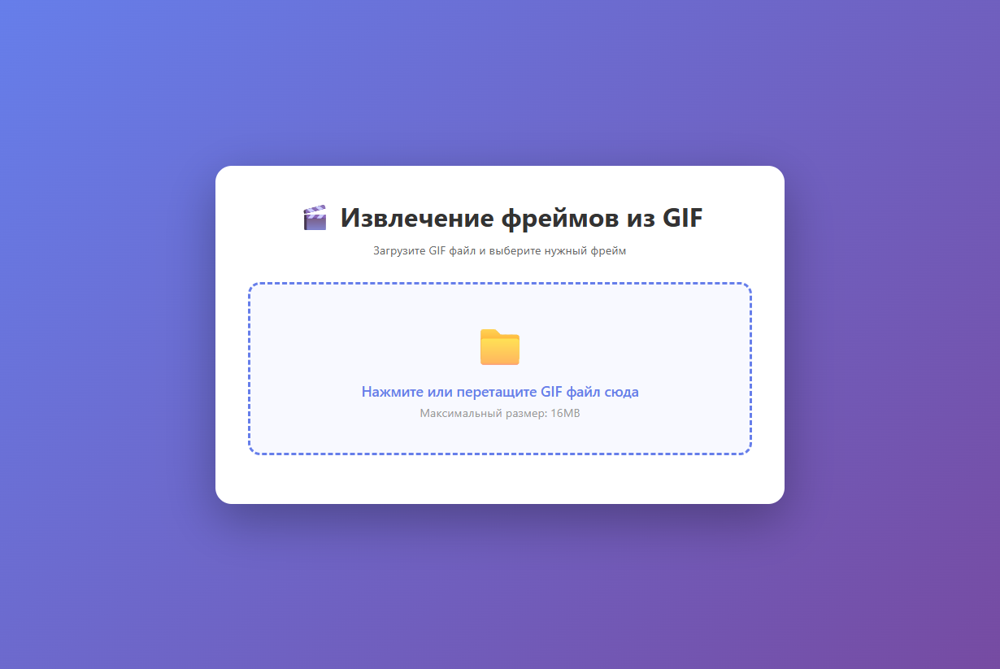

# Извлечение фреймов из GIF


Веб-приложение для извлечения отдельных фреймов из GIF файлов без использования готовых библиотек для работы с изображениями.

## Особенности

- ✅ Полностью ручной парсинг GIF формата (без PIL/Pillow/ImageIO)
- ✅ Ручная запись PNG файлов (без библиотек для работы с изображениями)
- ✅ Красивый веб-интерфейс с drag-and-drop и интерактивным слайдером
- ✅ Предзагрузка всех фреймов для мгновенного переключения
- ✅ Режим загрузки по требованию для экономии памяти
- ✅ Поддержка LZW декомпрессии
- ✅ Поддержка чересстрочных (interlaced) GIF
- ✅ Обработка цветовых таблиц
- ✅ Docker поддержка

## Требования

- Docker и Docker Compose

## Тестирование

Проект включает полное покрытие тестами (81%). Тесты автоматически запускаются при сборке Docker образа:

```bash
pytest --cov=. --cov-report=term --cov-report=html
```

**Статистика тестов:**
- 41 тест (все проходят)
- Покрытие кода: 81%
- Unit тесты для всех компонентов
- Интеграционные тесты с реальными GIF файлами

## Запуск

```bash
docker-compose up --build
```

Приложение будет доступно по адресу: http://localhost:5000

Для запуска в фоновом режиме:
```bash
docker-compose up -d --build
```

Остановка:
```bash
docker-compose down
```

## Использование

1. Откройте веб-интерфейс в браузере (http://localhost:5000)
2. Загрузите GIF файл (перетащите или выберите через диалог)
3. Используйте интерактивный слайдер для выбора фрейма - превью обновится автоматически
4. Нажмите "Сохранить фрейм" для скачивания PNG файла

## Скриншоты интерфейса

### Главная страница



Интерфейс с областью для загрузки GIF файла. Поддерживается drag-and-drop и выбор файла через диалог.

### Работа с загруженным GIF

После загрузки GIF файла интерфейс показывает:
- **Информацию о файле**: имя, размер, количество фреймов
- **Интерактивный слайдер**: для выбора нужного фрейма
- **Превью фрейма**: отображается в реальном времени при перемещении слайдера
- **Режимы загрузки**: 
  - Загрузка по требованию (экономия памяти)
  - Предзагрузка всех фреймов (мгновенное переключение)
- **Кнопка сохранения**: скачивание текущего фрейма в формате PNG

> 💡 **Совет:** Для просмотра интерфейса с загруженным GIF, запустите приложение (`docker-compose up`) и загрузите любой GIF файл через веб-интерфейс.

## Технические детали

### Парсинг GIF

Реализован полный парсер GIF формата:
- Чтение заголовка и логического экранного дескриптора
- Обработка глобальной и локальных таблиц цветов
- Парсинг дескрипторов изображений
- LZW декомпрессия данных изображения
- Деинтерлейсинг для чересстрочных изображений

### Запись PNG

Реализована запись PNG файлов:
- Создание IHDR chunk (заголовок)
- Подготовка данных изображения с фильтрацией
- Сжатие через zlib (стандартная библиотека Python)
- Создание IDAT chunk (данные)
- Вычисление CRC32 контрольных сумм
- Создание IEND chunk (конец файла)

## Ограничения

- Максимальный размер файла: 16MB
- Поддерживаются только RGB изображения (24 бита на пиксель)
- Поддерживается только метод сжатия deflate для PNG
- Не поддерживаются анимированные PNG (только статичные фреймы)

## Лицензия

Проект создан в образовательных целях.


